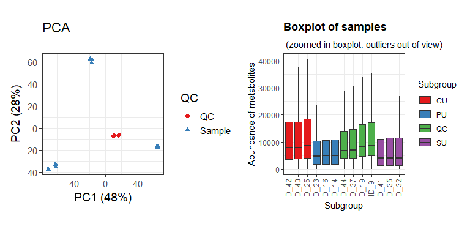
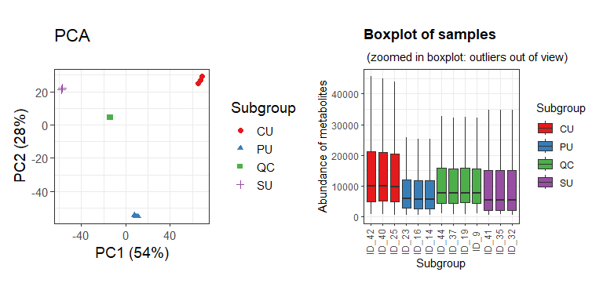
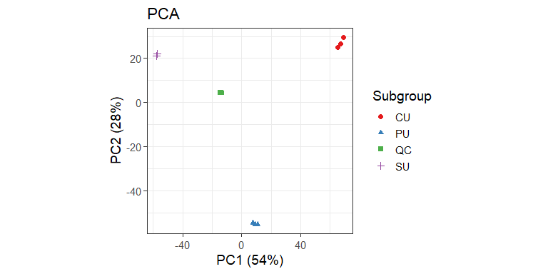
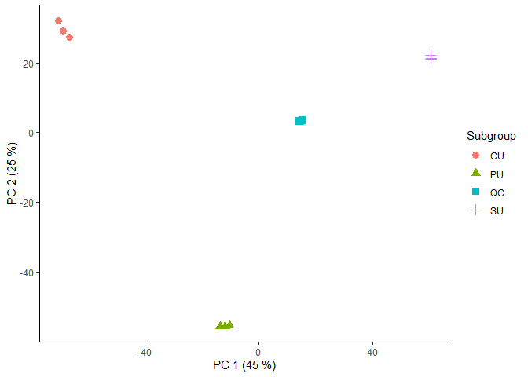

Negative_Antidiabetic and antioxidant potential of Oenocarpus bataua
Mart: a metabolomic and in silico study\*
================
Noroska G.S. Mogollón, Thomas Garzón
2025-08-05

- [Introduction](#introduction)
- [Before to start](#before-to-start)
- [Notame workflow](#notame-workflow)
- [Preprocessing](#preprocessing)
- [Second PCA and loading plot](#second-pca-and-loading-plot)

## Introduction

The present document aims to record the procedure given for the
statistical analysis of secondary metabolites present in the different
parts of Oenocarpus bataua. For each step a brief explanation, the code
and graphics obtained are included.

The workflow used is taken from the paper [“notame”: Workflow for
Non-Targeted LC–MS Metabolic
Profiling](https://doi.org/10.3390/metabo10040135). Which offers a wide
variety of functions to perform metabolomic profile analysis.

## Before to start

The “notame” package accepts as input a feature table that can be
obtained through software such as MZMine, MSDial, among others. In this
case, the table was obtained with the help of MS-DIAL. The (\*.txt) file
was slightly modified to obtain the feature table.

Modifications made to the raw (\*.txt) file can be summarized in adding
and renaming columns. The added columns “Column” and “Ion Mode” allow to
analyze samples with different types of columns and with different
ionization modes respectively. Also, the cells corresponding to mass and
retention time must be renamed so that the package can detect and
process it.

## Notame workflow

As a first step for the analysis, all the necessary libraries were
installed and loaded in Rstudio.

``` r
if (!requireNamespace("devtools", quietly = TRUE)) {
 install.packages("devtools")
}
#devtools::install_github("antonvsdata/notame", ref='v0.2.1')
library(notame)
library(Biobase)
library(BiocGenerics)
library(futile.logger)
library(ggplot2)
library(magrittr)
library(foreach)
library(iterators)
library(parallel)
library(doParallel)
if (!require("BiocManager", quietly = TRUE))
   install.packages("BiocManager")
#BiocManager::install("pcaMethods")
library(pcaMethods)
library(patchwork)
library(cowplot)
library(Rtsne)
library(ggdendro)
library(dplyr)
library(readxl)
library(ggsci)
```

Then, a log system was added to have a record of each process executed.

``` r
init_log(log_file = "Results_neg.txt")
```

    ## INFO [2025-08-12 17:27:03] Starting logging

Next, the feature list was imported.

``` r
data <- read_from_excel(file = "DATOS/UNG_nega.xlsx", sheet = 1, 
                        corner_row = 5,corner_column = "F", 
                        split_by = c("Column", "Ion Mode"))
```

Once the data was read, the next step was to create a MetaboSet in order
to create a specific R object.

``` r
modes <- construct_metabosets(exprs = data$exprs, 
                              pheno_data = data$pheno_data, 
                              feature_data = data$feature_data,
                              group_col = "Subgroup")
```

Finally, each mode was extracted in a single object.

``` r
mode <- modes$RP_negative
```

As a additional step, we can visualize the raw data in order to inspect
the processing routines.

``` r
Prueba_mode <- modes$RP_negative
POS_raw_sambx <- plot_sample_boxplots(Prueba_mode, order_by = "Subgroup", fill_by = "Subgroup")
POS_raw_pca <- plot_pca(Prueba_mode, color = "QC")
POS_raw_pca + POS_raw_sambx
```

<!-- -->

In the boxplot we can see how the abundance of metabolites present in
the QCs vary between them, so the drift correction is necessary.

## Preprocessing

The first step of the preprocessing is to change the features with value
equal to 0 to NA.

``` r
mode <- mark_nas(mode, value = 0)
```

Then, features with low detection rate are first flagged and then will
be removed. The notame package employs two criteria to select this
features. First, is the feature presence in a percentage of QC
injections, and then the feature presence in a percentage within a
sample group or class.

``` r
mode <- flag_detection(mode, qc_limit = 0.70, group_limit = 0.75)
```

With these values, features which that were not detected in the 75% of
the QC injections and 90% of sample groups will be discarded.

The next steps for preprocessing correspond to drift correction. The
drift correction can be applied by smoothed cubic spline regression.

``` r
corrected <- correct_drift(mode)
corrected <- correct_drift(mode)
corrected <- flag_quality(corrected)
```

Then we can visualize the correction for QCs.

``` r
EI_corr_sambx <- plot_sample_boxplots(corrected, order_by = "Subgroup", fill_by = "Subgroup")
EI_corr_pca <- plot_pca(corrected, center = T)
EI_corr_pca + EI_corr_sambx
```

<!-- -->

``` r
EI_PCA_2<-plot_pca(corrected, color = "Subgroup")
EI_PCA_2
```

<!-- -->
imputación de datos

``` r
# To clean data
set.seed(8)
imputed <- impute_rf(corrected)
```

    ## INFO [2025-08-12 17:27:27] 
    ## Starting random forest imputation at 2025-08-12 17:27:27.483719
    ## INFO [2025-08-12 17:27:44] Out-of-bag error in random forest imputation: 0.023
    ## INFO [2025-08-12 17:27:44] Random forest imputation finished at 2025-08-12 17:27:44.939967

``` r
# Probabilistic quotient normalization
pqn_set <- pqn_normalization(imputed,
                             ref = c("qc", "all"),
                             method = c("median", "mean"),
                             all_features = FALSE)
```

    ## INFO [2025-08-12 17:27:44] Starting PQN normalization
    ## INFO [2025-08-12 17:27:45] Using median of qc samples as reference spectrum

# Second PCA and loading plot

Droping flagged features

``` r
no_flag <- drop_flagged(imputed)

# Extracting feature table (Expression data)
peak_Height <- exprs(no_flag)

# Extracting Phenotipic data
EI_pheno_data <- no_flag@phenoData@data
```

Preparing data and transposing feature table.

``` r
EI_feat_table_pca  <- t(peak_Height)

#Changing NA to 0 
EI_feat_table_pca[is.na(EI_feat_table_pca)]=0

# Centering and Scaling features
EI_pca <- prcomp(EI_feat_table_pca, center = T, scale. = T)
```

Plotting PCA results.

``` r
scores <- EI_pca$x %>%               # Get PC coordinates
  data.frame %>%                            # Convert to data frames
  mutate(Sample_ID = rownames(.)) %>%       # Create a new column with the sample names
  left_join(EI_pheno_data )                  # Adding metadata

ggplot(scores, aes(PC1, PC2, color = Subgroup, shape = Subgroup)) + geom_point(size = 3)  + guides(x=guide_axis(title = "PC 1 (45 %)"), y=guide_axis(title = "PC 2 (25 %)")) +
  theme_classic()
```

<!-- -->

``` r
# Save plot
ggsave('unguragua_nrg.png', width = 5, height = 4, device='png', dpi="print")
```

\#Finish a record.

``` r
finish_log()
```

    ## INFO [2025-08-12 17:27:45] Finished analysis. Tue Aug 12 17:27:45 2025
    ## Session info:
    ## 
    ## INFO [2025-08-12 17:27:45] R version 4.5.1 (2025-06-13 ucrt)
    ## INFO [2025-08-12 17:27:45] Platform: x86_64-w64-mingw32/x64
    ## INFO [2025-08-12 17:27:45] Running under: Windows 11 x64 (build 26100)
    ## INFO [2025-08-12 17:27:45] 
    ## INFO [2025-08-12 17:27:45] Matrix products: default
    ## INFO [2025-08-12 17:27:45]   LAPACK version 3.12.1
    ## INFO [2025-08-12 17:27:45] 
    ## INFO [2025-08-12 17:27:45] locale:
    ## INFO [2025-08-12 17:27:45] [1] LC_COLLATE=Spanish_Ecuador.utf8  LC_CTYPE=Spanish_Ecuador.utf8   
    ## INFO [2025-08-12 17:27:45] [3] LC_MONETARY=Spanish_Ecuador.utf8 LC_NUMERIC=C                    
    ## INFO [2025-08-12 17:27:45] [5] LC_TIME=Spanish_Ecuador.utf8    
    ## INFO [2025-08-12 17:27:45] 
    ## INFO [2025-08-12 17:27:45] time zone: America/Guayaquil
    ## INFO [2025-08-12 17:27:45] tzcode source: internal
    ## INFO [2025-08-12 17:27:45] 
    ## INFO [2025-08-12 17:27:45] attached base packages:
    ## INFO [2025-08-12 17:27:45] [1] parallel  stats     graphics  grDevices utils     datasets  methods  
    ## INFO [2025-08-12 17:27:45] [8] base     
    ## INFO [2025-08-12 17:27:45] 
    ## INFO [2025-08-12 17:27:45] other attached packages:
    ## INFO [2025-08-12 17:27:45]  [1] ggsci_3.2.0         readxl_1.4.5        dplyr_1.1.4        
    ## INFO [2025-08-12 17:27:45]  [4] ggdendro_0.2.0      Rtsne_0.17          cowplot_1.1.3      
    ## INFO [2025-08-12 17:27:45]  [7] patchwork_1.3.1     pcaMethods_2.0.0    BiocManager_1.30.26
    ## INFO [2025-08-12 17:27:45] [10] doParallel_1.0.17   iterators_1.0.14    foreach_1.5.2      
    ## INFO [2025-08-12 17:27:45] [13] notame_0.3.1        magrittr_2.0.3      ggplot2_3.5.2      
    ## INFO [2025-08-12 17:27:45] [16] futile.logger_1.4.3 Biobase_2.68.0      BiocGenerics_0.54.0
    ## INFO [2025-08-12 17:27:45] [19] generics_0.1.4     
    ## INFO [2025-08-12 17:27:45] 
    ## INFO [2025-08-12 17:27:45] loaded via a namespace (and not attached):
    ## INFO [2025-08-12 17:27:45]  [1] tidyselect_1.2.1     viridisLite_0.4.2    farver_2.1.2        
    ## INFO [2025-08-12 17:27:45]  [4] fastmap_1.2.0        promises_1.3.3       digest_0.6.37       
    ## INFO [2025-08-12 17:27:45]  [7] mime_0.13            lifecycle_1.0.4      ellipsis_0.3.2      
    ## INFO [2025-08-12 17:27:45] [10] compiler_4.5.1       rngtools_1.5.2       rlang_1.1.6         
    ## INFO [2025-08-12 17:27:45] [13] tools_4.5.1          yaml_2.3.10          knitr_1.50          
    ## INFO [2025-08-12 17:27:45] [16] lambda.r_1.2.4       doRNG_1.8.6.2        askpass_1.2.1       
    ## INFO [2025-08-12 17:27:45] [19] labeling_0.4.3       htmlwidgets_1.6.4    pkgbuild_1.4.8      
    ## INFO [2025-08-12 17:27:45] [22] RColorBrewer_1.1-3   pkgload_1.4.0        miniUI_0.1.2        
    ## INFO [2025-08-12 17:27:45] [25] withr_3.0.2          purrr_1.0.4          itertools_0.1-3     
    ## INFO [2025-08-12 17:27:45] [28] sys_3.4.3            grid_4.5.1           urlchecker_1.0.1    
    ## INFO [2025-08-12 17:27:45] [31] profvis_0.4.0        xtable_1.8-4         scales_1.4.0        
    ## INFO [2025-08-12 17:27:45] [34] MASS_7.3-65          cli_3.6.5            rmarkdown_2.29      
    ## INFO [2025-08-12 17:27:45] [37] ragg_1.4.0           remotes_2.5.0        rstudioapi_0.17.1   
    ## INFO [2025-08-12 17:27:45] [40] sessioninfo_1.2.3    cachem_1.1.0         formatR_1.14        
    ## INFO [2025-08-12 17:27:45] [43] cellranger_1.1.0     vctrs_0.6.5          devtools_2.4.5      
    ## INFO [2025-08-12 17:27:45] [46] systemfonts_1.2.3    credentials_2.0.2    tidyr_1.3.1         
    ## INFO [2025-08-12 17:27:45] [49] missForest_1.5       glue_1.8.0           codetools_0.2-20    
    ## INFO [2025-08-12 17:27:45] [52] stringi_1.8.7        gtable_0.3.6         later_1.4.2         
    ## INFO [2025-08-12 17:27:45] [55] tibble_3.3.0         pillar_1.10.2        htmltools_0.5.8.1   
    ## INFO [2025-08-12 17:27:45] [58] randomForest_4.7-1.2 openssl_2.3.3        R6_2.6.1            
    ## INFO [2025-08-12 17:27:45] [61] textshaping_1.0.1    gert_2.1.5           evaluate_1.0.4      
    ## INFO [2025-08-12 17:27:45] [64] shiny_1.11.0         futile.options_1.0.1 openxlsx_4.2.8      
    ## INFO [2025-08-12 17:27:45] [67] memoise_2.0.1        httpuv_1.6.16        Rcpp_1.0.14         
    ## INFO [2025-08-12 17:27:45] [70] zip_2.3.3            xfun_0.52            fs_1.6.6            
    ## INFO [2025-08-12 17:27:45] [73] usethis_3.1.0        pkgconfig_2.0.3
